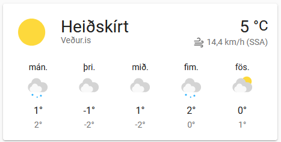
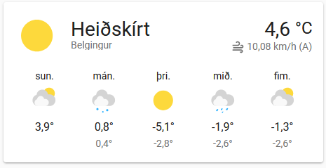
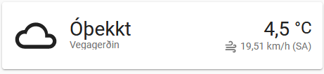

# Home Assistant Icelandic weather cards
Here are some of my custom [Home Assistant] packages for displaying Icelandic weather information from local Icelandic sources.

If you want to support me, you can donate to me with [PayPal].

## Requirements
Working setup of [Home Assistant] and access to [configuration.yaml]

## Installing
Go to the releases page and download the latest release and unzip to the root folder of your [Home Assistant] samba folder. Edit `config/configuration.yaml` and add the following to the `homeassistant` section to include all packages:

```yaml
homeassistant:
  packages: !include_dir_named packages
```

or you can include only specific packages:

```yaml
homeassistant:
  packages:
    vedur_is: !include packages/vedur_is.yaml
    vegagerdin: !include packages/vegagerdin.yaml
    belgingur: !include packages/belgingur.yaml
```
Then restart Home Assistant.

## Available weather cards
- [Veður.is](#vedur)
- [Belgingur](#belgingur)
- [Vegagerðin](#vegagerdin)

## <a name="vedur"></a>Veður.is (vedur_is.yaml)


Weather information from vedur.is. The weather card is named `weather.vedur_is`. Just add this as any other normal weather card. The integration calls XML services as specified in [Gagnaveita - XML þjónusta] every 10 minutes for temperature data and every hour for forecast data. The XML data is cached locally in folder /config/www/vedur_is.

### Customizing what weather station to use for vedur.is
Default weather station is Reykjavík with id=1. You can find out other ids by checking [Veðurstöðvar]. Click on `Upplýsingar` and find out the `Stöðvanúmer`. You can then go to `Developer tools` and find the entity `input_number.vedurstod` and change the state to the selected id number or simply add this entity to a dashboard and modify the station id directly there.

### Display text weather description in a markdown card.
You can display vedur.is weather description for the capital Reykjavik and the whole country in a markdown card by adding a mark down card and specifying for example this content:

```markdown
**{{ state_attr('sensor.vedur_text_capital','friendly_name') }}**
{{ state_attr('sensor.vedur_text_capital','text') }}

**{{ state_attr('sensor.vedur_text_country','friendly_name') }}**
{{ state_attr('sensor.vedur_text_country','text') }}

[Veðurspá](https://www.vedur.is/vedur/spar/thattaspar/hofudborgarsvaedid/#teg=urkoma)
```

## <a name="belgingur"></a>Belgingur (belgingur.yaml)


Weather forecast information from belgingur.is. The weather card is named `weather.belgingur`. Just add this as any other normal weather card. The card uses your current Home position for weather location as specified in General configuration. The information is updated every 10 minutes.

## <a name="vegagerdin"></a>Vegagerðin (vegagerdin.yaml)


Weather information from vegagerdin.is. The weather card is named `weather.vegagerdin`. This card used 
[Gagnaveita Vegagerðarinnar] to retrieve weather information. This only includes current temperature and other measurements but no description or weather forecast. The data updates every 10 minutes.

### Customizing weather station to use for vegagerðin
Default weather station is `Reykjavík`. You can find out other names by checking [Gagnaveita] and finding your station `Nafn` in the list. You can then go to `Developer tools` and find the entity `input_text.vegagerdin_vedurstod` and change the value or simply add this entity to a dashboard and modify the station name directly there.

## Custom weather card
You can either use the included weather cards directly as is or create your own custom weather card using information from different sources, by adding something like this in your `configuration.yaml` which integrates sensors from all the different sources.

```yaml
weather:
  - platform: template
    name: "My custom weather"
    attribution_template: "Veður.is/Vegagerðin/Belgingur"
    condition_template: "{{ states('sensor.belgingur_condition') }}"
    temperature_template: "{{ states('sensor.vegagerdin_temperature') }}"
    humidity_template: "{{ states('sensor.vedur_humidity') }}"
    pressure_template: "{{ states('sensor.vedur_pressure') }}"
    wind_speed_template: "{{ states('sensor.belgingur_wind_speed') }}"
    wind_bearing_template: "{{ states('sensor.belgingur_wind_bearing') }}"
    visibility_template: "{{ states('sensor.vedur_visibility') }}"
    forecast_template: "{{ state_attr('sensor.vedur_forecast','forecast') }}"
```

[Home Assistant]: https://www.home-assistant.io
[Gagnaveita - XML þjónusta]: https://www.vedur.is/um-vi/vefurinn/xml
[Veðurstöðvar]: https://www.vedur.is/vedur/stodvar
[Gagnaveita Vegagerðarinnar]: http://www.vegagerdin.is/upplysingar-og-utgafa/gagnaveita-vegagerdarinnar
[Gagnaveita]: http://gagnaveita.vegagerdin.is/api/vedur2014_1
[PayPal]: https://paypal.me/kristjanbjarni
[configuration.yaml]: https://www.home-assistant.io/docs/configuration/
