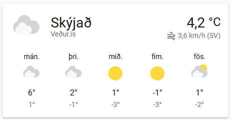

# Home Assistant Packages
Here are some of my custom [Home Assistant] packages for displaying Icelandic weather information from local Icelandic sources.

<!---<a href="https://www.buymeacoffee.com/kristjanbjarni" target="_blank"></a>
-->
If you want to support me, you can donate to me with [PayPal]:

<a href="https://paypal.me/kristjanbjarni" target="_blank"></a>

## Requirements
Working setup of [Home Assistant]

## Installing
Go to the releases page and download the latest release and unzip to the root folder of your [Home Assistant] setup. Edit `config/configuration.yaml` and add the following to the `homeassistant` section to include all packages:

```yaml
homeassistant:
  packages: !include_dir_named packages
```

or just include only the specific packages you want to use:

```yaml
homeassistant:
  packages:
    vedur_is: !include packages/vedur_is.yaml
    vegagerdin: !include packages/vegagerdin.yaml
    belgingur: !include packages/belgingur.yaml
```

## Included packages
- [vedur_is.yaml](#vedur) 
- [belgingur.yaml](#belgingur)
- [vegagerdin.yaml](#vegagerdin)

## <a name="vedur"></a>vedur_is.yaml


Weather information from vedur.is. The weather card is named `weather.vedur_is`. Just add this as any other normal weather card. This integration calls XML services as specified in [Gagnaveita - XML þjónusta].

### Customizing what weather station to use for vedur.is
Default weather station is id=1 which is Reykjavík. You can find out other ids by checking [Veðurstöðvar]. Click on `Upplýsingar` and find out the `Stöðvanúmer`. You can then go to `Developer tools` and find the entity `input_number.vedurstod` and change the state to the selected id number or simply add this entity to a dashboard and modify the station id there.

### Display text weather description in a markdown card.
You can display vedur.is weather description for the capital Reykjavik and the whole country in a markdown card by adding a mark down card and specifying this content:

```markdown
**{{ state_attr('sensor.vedur_text_capital','friendly_name') }}**
{{ state_attr('sensor.vedur_text_capital','text') }}

**{{ state_attr('sensor.vedur_text_country','friendly_name') }}**
{{ state_attr('sensor.vedur_text_country','text') }}

[Veðurspá](https://www.vedur.is/vedur/spar/thattaspar/hofudborgarsvaedid/#teg=urkoma)
```

## <a name="belgingur"></a>belgingur.yaml


Weather information from belgingur.is. The weather card is named `weather.belgingur`. Just add this as any other normal weather card. The card uses your current Home position for weather location as specified in General configuration.

## <a name="vegagerdin"></a>vegagerdin.yaml


Weather information from vegagerdin.is. The weather card for is named `weather.vegagerðin`. This card used 
[Gagnaveita Vegagerðarinnar] to retrieve weather information. This only includes current temperature and other measurements but no description or weather forecast.

### Customizing weather station to use for vegagerðin
Default weather station is `Reykjavík`. You can find out other names by checking [Gagnaveita] and finding your station `Nafn` in the list. You can then go to `Developer tools` and find the entity `input_text.vegagerdin_vedurstod` and change the value or simply add this entity to a dashboard and modify the station name there.

## Custom weather card
You can either use the included weather cards or create your own custom weather card using information from different sources, by adding something like this in `configuration.yaml`

```yaml
weather:
  - platform: template
    name: "Custom weather"
    attribution_template: "Veður.is/Vegagerðin/Belgingur"
    condition_template: "{{ states('sensor.belgingur_condition') }}"
    temperature_template: "{{ states('sensor.vegagerdin_temperature') }}"
    humidity_template: "{{ states('sensor.vedur_humidity')}}"
    pressure_template: "{{ states('sensor.vedur_pressure')}}"
    wind_speed_template: "{{ states('sensor.belgingur_wind_speed') }}"
    wind_bearing_template: "{{ states('sensor.belgingur_wind_bearing') }}"
    visibility_template: "{{ states('sensor.vedur_visibility') }}"
    forecast_template: "{{ state_attr('sensor.vedur_forecast','forecast') }}"
```

[Home Assistant]: https://www.home-assistant.io
[Gagnaveita - XML þjónusta]: https://www.vedur.is/um-vi/vefurinn/xml
[Veðurstöðvar]: https://www.vedur.is/vedur/stodvar
[Gagnaveita Vegagerðarinnar]: http://www.vegagerdin.is/upplysingar-og-utgafa/gagnaveita-vegagerdarinnar
[Gagnaveita]: http://gagnaveita.vegagerdin.is/api/vedur2014_1
[PayPal]: https://paypal.me/kristjanbjarni
